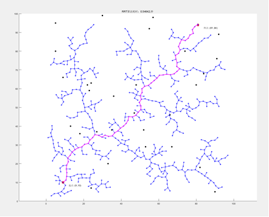

# Dynamic-obstacle-avoidance-based-on-Astar-and-APF-algorithms
Dynamic obstacle avoidance based on A * algorithm and artificial potential field method, including A*, APF, RRT algorithm, and simple cluster dynamic obstacle avoidance.

 
 

 

 
 
